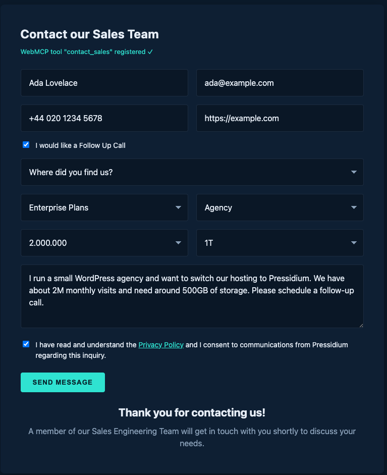

# Implementing WebMCP on a Real Site: Exposing a Contact Form to AI Agents

> The full source for this article lives in the [GitHub repo](https://github.com/pressidium/webmcp-example). Clone it, run `python3 -m http.server 8000` from the repo root, and open `http://localhost:8000/demo/index.html`.

## Why this article exists

AI agents are showing up in browsers. Chrome's WebMCP proposal lets your site tell those agents, directly and in a structured way, what they can do on your page. The alternative is what agents do today: scrape the DOM, read the accessibility tree, take screenshots, and guess. That's brittle, slow, expensive in tokens, and a delightful target for prompt injection.

WebMCP swaps that out for something boring and reliable: **typed tools, called directly**. Your form becomes an API, and the agent calls it the same way it would call any other server-side MCP tool.

This article walks through adding WebMCP to a real, ordinary contact form, the kind that exists on every B2B site on the internet, and ends with a working demo you can crib from. You'll see both APIs WebMCP ships with (imperative JavaScript and declarative HTML), and the trade-offs between them.

## What you'll build

A "Contact our Sales Team" form on [Pressidium®](https://pressidium.com/), exposed as a single WebMCP tool called `contact_sales`. It's the same form we use to talk to prospects about [managed WordPress hosting](https://pressidium.com/wordpress-hosting-plans/), now agent-callable. An agent calls it with structured arguments; the tool fills and submits the form on the user's behalf, no DOM scraping required.


Twelve fields, five selects, two checkboxes, one textarea. Realistic enough to be useful, simple enough to fit in one tool.

## The problem WebMCP solves

When an agent today wants to fill the form above, it has to:

1. Render the page.
2. Walk the DOM and the accessibility tree to find inputs.
3. Guess the meaning of each field from `aria-*`, `placeholder`, `name`, surrounding text, sometimes screenshots.
4. Decide which field is which option in each `<select>`.
5. Type, click, and hope nothing moved between the time it planned and the time it acted.

Each of those steps is a place to be wrong. They're also each a place to be *attacked*: a malicious widget on the page can put plausible-looking text in the DOM and the agent will dutifully read it.

WebMCP cuts the loop. Your site declares a contract:

> "I have a tool called `contact_sales`. Here is its JSON schema. Here is what each field means. Call it."

The agent calls it. Your code runs. The DOM is an implementation detail again.

## Setting up the demo

There's no build step. The whole demo is five files of vanilla HTML, CSS, and JS. To follow along:

```bash
git clone https://github.com/pressidium/webmcp-example.git
cd webmcp-example
python3 -m http.server 8000
# open http://localhost:8000/demo/index.html
```

You'll need a browser that speaks WebMCP. As of writing, that's Chrome Canary 146+ with `chrome://flags/#enable-webmcp-testing` enabled. The [Model Context Tool Inspector](https://developer.chrome.com/docs/ai/webmcp#imitate-agent-chat-with-the-inspector-extension) Chrome extension is useful for inspecting and manually invoking the registered tool. Without WebMCP support, the form still works. It just doesn't expose any tools.

Here's the markup we're starting from (truncated; full file in [`demo/index.html`](https://github.com/pressidium/webmcp-example/blob/main/demo/index.html)):

```html
<form id="sales-form-contact" class="js-company-form" novalidate>
  <input type="text"  name="fullname" placeholder="Your full name" required />
  <input type="email" name="email"    placeholder="Your email address" required />
  <input type="tel"   name="phone"    placeholder="Phone Number" />
  <input type="text"  name="website"  placeholder="Website URL" required />

  <label><input type="checkbox" name="followup" /> I would like a Follow Up Call</label>

  <select name="referrer">
    <option value="" disabled selected>Where did you find us?</option>
    <option value="Search engine">Search engine</option>
    <option value="Friend/Colleague recommendation">Friend/Colleague recommendation</option>
    <!-- … -->
  </select>

  <!-- plan, industry, visits, storage, message, privacyConsent … -->

  <button type="submit">SEND MESSAGE</button>
</form>
```

Nothing fancy. A plain form, the kind that already exists on your site. We're going to leave the HTML untouched and add WebMCP from the outside.

> **Field-naming note:** the field names below (`fullname`, `website`, `privacyConsent`, …) match the live Pressidium form exactly. When you add WebMCP to your own site, keep your existing field names. Don't normalise them. The tool's input schema should match what your form already expects, so `execute` can hand values straight through.

## The Imperative API: registering the tool in JavaScript

The Imperative API lives on `navigator.modelContext`. You hand it an object describing your tool (a name, a description, a JSON schema, and an `execute` function), and the browser exposes that to any agent that asks.

Here is the whole thing for our form. Read it once; we'll unpack the decisions after.

```js
navigator.modelContext.registerTool({
  name: 'contact_sales',
  title: 'Contact Pressidium Sales',
  description:
    'Send an inquiry to the Pressidium sales team about managed WordPress hosting. ' +
    'Use this tool when the user wants to reach out about plans, pricing, migration, ' +
    'or to schedule a sales call. Submits the form on the user\'s behalf.',
  inputSchema: {
    type: 'object',
    properties: {
      fullname:       { type: 'string',  description: '…' },
      email:          { type: 'string',  format: 'email', description: '…' },
      phone:          { type: 'string',  description: '…' },
      website:        { type: 'string',  description: '…' },
      followup:       { type: 'boolean', description: '…' },
      referrer:       { type: 'string',  enum: REFERRER_OPTIONS, description: '…' },
      plan:           { type: 'string',  enum: PLAN_OPTIONS,     description: '…' },
      industry:       { type: 'string',  enum: INDUSTRY_OPTIONS, description: '…' },
      visits:         { type: 'string',  enum: VISITS_OPTIONS,   description: '…' },
      storage:        { type: 'string',  enum: STORAGE_OPTIONS,  description: '…' },
      message:        { type: 'string',  description: '…' },
      privacyConsent: { type: 'boolean', description: '…' },
    },
    required: ['fullname', 'email', 'website', 'plan', 'industry', 'message', 'privacyConsent'],
  },
  annotations: { readOnlyHint: false, destructiveHint: false },
  execute: async (input) => {
    if (input.privacyConsent !== true) {
      return {
        ok: false,
        error: 'consent_required',
        message: 'Privacy Policy consent is required to submit this form. Ask the user to confirm before retrying.',
      };
    }
    const form = document.getElementById('sales-form-contact');
    for (const [key, value] of Object.entries(input)) {
      const el = form.elements[key];
      if (!el) continue;
      if (el.type === 'checkbox') el.checked = value === true;
      else if (value != null)     el.value   = value;
    }
    form.requestSubmit();
    return {
      ok: true,
      message: `Inquiry submitted for ${input.fullname}. The Pressidium Sales Engineering team will reply to ${input.email}.`,
    };
  },
});
```

Five things are doing the work here. Each maps to a decision you'll make for your own forms.

### 1. The name is a verb

`contact_sales`, not `sales_form` or `pressidium_contact`. Chrome's [best-practices doc](https://developer.chrome.com/docs/ai/webmcp/best-practices) makes the point sharply:

> When writing tool names, distinguish execution from initiation, and use verbs that describe exactly what happens.

If your tool *opens* a form, name it `start_sales_inquiry`. If it *submits* one, name it `contact_sales`. Ours does both, and the name reflects that.

### 2. The description tells the agent when to use it

The first sentence describes what the tool *does*. The second tells the agent *when* to reach for it. That's deliberate. Agents pick tools by reading the description, and "when to use it" is the harder half of the decision.

Avoid the trap of writing negative descriptions ("Don't use this for support requests"). Limitations should be implicit in a well-written description. List the cases the tool *is* for; let the agent infer the rest.

### 3. The schema accepts raw user input

`phone` is a `string`, not a structured `{ countryCode, number }`. `message` is free text. We do not ask the agent to do arithmetic, normalise dates, or rephrase the user's words. Same advice from Chrome's guide:

> Accept raw user input. Avoid asking the agent to perform math or transform the input strings.

The places we *do* constrain (`referrer`, `plan`, `industry`, `visits`, `storage`) are constrained with `enum`, because the underlying `<select>` only accepts those exact strings. Mismatches there are the easiest way to ship a broken tool. Notice the `visits` values are written `"1.000.000"` (European thousands-separator) and the storage values are `"120GB"`, `"1T"`, `"2T"`. The schema repeats whatever the form has, verbatim. Don't pretty-print them in the schema; the `<select>` won't accept the prettier version.

### 4. `required` matches the form, not the schema

Seven fields are required: `fullname`, `email`, `website`, `plan`, `industry`, `message`, and `privacyConsent`. That mirrors what the HTML enforces with the `required` attribute, and crucially, it matches what's *legally* required (`privacyConsent`). We re-check `privacyConsent` inside `execute` because schemas are advisory: a misbehaving agent can omit required fields. Validate strictly in code, loosely in schema.

### 5. `execute` is small on purpose

It does three things: validate the one rule the schema can't enforce, fill the form, submit it. It does not invent new fields. It does not transform values. It does not call `fetch()` directly. It goes through the same submit handler a human would trigger, so any future tweak to that handler (analytics, validation, retries) keeps working.

The return value is a structured object the agent reads back. A successful call returns `{ ok: true, message: "…" }`; a failure returns `{ ok: false, error: "consent_required", message: "…" }`. The `message` is written for the agent to relay to the user: short, action-oriented, no jargon.

## The Declarative API: same contract, in HTML

The Imperative API is a JavaScript object. The Declarative API is the same idea expressed as HTML attributes on a `<form>`. No JavaScript, no `registerTool` call. The browser sees the attributes and exposes the tool for you.

Here's the same form, rewritten declaratively. Compare against [`demo/declarative.html`](https://github.com/pressidium/webmcp-example/blob/main/demo/declarative.html) for the full thing:

```html
<form
  id="sales-form-contact"
  class="js-company-form"
  toolname="contact_sales"
  tooldescription="Send an inquiry to the Pressidium sales team about managed WordPress hosting. Use this when the user wants to reach out about plans, pricing, migration, or to schedule a sales call."
  toolautosubmit
>
  <input type="text" name="fullname" required
         toolparamdescription="The person's full name as they want it to appear on the inquiry." />

  <input type="email" name="email" required
         toolparamdescription="Email address where the sales team should reply." />

  <select name="plan" required
          toolparamdescription="Which Pressidium plan the user is interested in.">
    <option value="" disabled selected>Which Plan are you interested in?</option>
    <option value="Enterprise Plans">Enterprise Plans</option>
    <option value="Standard Plans">Standard Plans</option>
    <option value="I am not sure">I am not sure</option>
  </select>

  <!-- … the remaining fields, each with toolparamdescription … -->

  <button type="submit">SEND MESSAGE</button>
</form>
```

Three attributes do all the work:

- `toolname` and `tooldescription` on the `<form>` itself — the same two strings you'd pass to `registerTool`.
- `toolparamdescription` on each input — the per-field description.
- `toolautosubmit` (optional) — when set, the browser submits the form for you after filling it. Drop it if you want the agent to fill the form but let the user click *SEND MESSAGE* themselves.

The browser infers the JSON schema from the HTML: `type="email"` becomes `format: "email"`, `<select>` options become an `enum`, `required` becomes `required`, `type="checkbox"` becomes `boolean`. You don't write the schema twice.

### When to choose which API

| | Imperative | Declarative |
|---|---|---|
| **Lines of code** | ~70 (JS) for our form | 0 extra JS, ~12 attributes on the HTML |
| **You control submission** | Yes — your `execute` function decides | Browser submits on your behalf (with `toolautosubmit`) |
| **You return structured output** | Yes — return any JSON from `execute` | No — the agent only sees that the form submitted |
| **Dynamic registration** | Yes — call `registerTool` / `unregisterTool` based on app state | Yes — add or remove the `toolname` attribute to register/unregister |
| **Custom validation** | Easy — your `execute` can refuse and explain why | Harder — you rely on HTML validation + the browser |
| **Type safety beyond HTML** | Full JSON Schema | Limited to what HTML input types express |
| **Best for** | Multi-step flows, complex validation, returning rich results | Plain forms whose contract is already in the HTML |

A practical rule: **start declarative, escalate to imperative when you need to either return structured data or run logic before/after the submit**. Our contact form is right on the line. The declarative version is shorter; the imperative version lets us reject submissions where `privacyConsent !== true` with a useful error message the agent can act on. Both are valid; for this article we ship both.

## Best practices, applied to this form

Chrome's [WebMCP best-practices doc](https://developer.chrome.com/docs/ai/webmcp/best-practices) is short and worth reading in full. Here's how each piece lands on our example.

### One tool, one job

Our `contact_sales` tool does one thing: submit a contact inquiry. We considered splitting it (`populate_contact_form` + `submit_contact_form`), the way Chrome's warranty-claim example splits `populate_product_details` from `describe_issue`. We didn't, because:

- The form is short. The user's intent ("contact sales") maps cleanly to one action.
- Splitting would force the agent to make two correct calls instead of one, with no upside.

The rule is "each tool should consist of a single function". For a longer, multi-step flow (think: shopping cart, then shipping, then payment), you split. For a single-page inquiry, you don't.

### Clear language, semantic HTML

The tool name (`contact_sales`) is a verb. The description names the audience ("the Pressidium sales team") and the trigger ("when the user wants to reach out about plans"). Every parameter has a description, not just a type. The agent reads those descriptions; vague ones cost you correctness.

The underlying form is plain, semantic HTML. We didn't add ARIA scaffolding for the agent's benefit; the agent doesn't read the DOM. Keep the form accessible because it's accessible; humans still use it.

### Accept raw input; constrain only what you must

`phone` is a string. `website` is a string. `message` is a free-text string. We didn't add `pattern` constraints, length limits, or shape validation in the schema. The user typed what they typed; we pass it through.

The fields we *did* constrain are the `<select>` dropdowns, and we constrained them with `enum`, listing the exact strings the dropdowns accept. That's the place a mismatch would silently break the tool. A `plan` of `"enterprise"` (lowercase) wouldn't match `"Enterprise Plans"` in the option list, and the form would submit empty. Same with `visits: "2M"` vs. the real value `"2.000.000"`. Lock those down to whatever your HTML actually accepts.

### Validate strictly in code, loosely in schema

The schema says `privacyConsent` is a boolean. The `execute` function refuses the call if `privacyConsent !== true`. Same idea, two layers:

```js
if (input.privacyConsent !== true) {
  return {
    ok: false,
    error: 'consent_required',
    message: 'Privacy Policy consent is required to submit this form. Ask the user to confirm before retrying.',
  };
}
```

The schema *suggests* the rule. The code *enforces* it. The error message is written for the agent: a sentence it can relay to the user, a verb it can act on ("ask the user to confirm").


### Reuse the human UI, degrade gracefully

`execute` calls `form.requestSubmit()`, which triggers the same submit handler a human click would. That handler hides the form and reveals the "Thank you for contacting us!" block. A follow-up agent action ("did the form submit?") can inspect the page state and see the thank-you DOM. The UI doubles as the agent's audit log.

Not every browser speaks WebMCP yet. Our `webmcp-tools.js` checks for it and bails cleanly:

```js
if (!('modelContext' in navigator) || typeof navigator.modelContext.registerTool !== 'function') {
  status.textContent = 'WebMCP not available in this browser — the form still works.';
  return;
}
```

The form still works without WebMCP; humans fill and submit it as always. WebMCP is additive. If you ever find yourself making the form *require* WebMCP, you've taken a wrong turn.

## Testing your tool

WebMCP isn't a deterministic API. Agents will call your tool with inputs you didn't predict, and you'll want to see what happens. Two tools help.

### The Model Context Tool Inspector

The [Model Context Tool Inspector](https://developer.chrome.com/docs/ai/webmcp#imitate-agent-chat-with-the-inspector-extension) is a Chrome extension that adds a panel listing every tool registered on the current page, lets you call them manually with arbitrary JSON, and shows the return value. Use it to:

- Confirm your tool registered (name, description, schema all correct).
- Call it with realistic inputs and watch the page react.
- Call it with *unrealistic* inputs (missing required fields, wrong enum values, `privacyConsent: false`) and confirm your error messages are useful.

### A quick console smoke test

You don't need an extension to sanity-check the basics. Paste this into the DevTools console on `demo/index.html`:

```js
// 1. Tool is registered with the expected schema
const info = navigator.modelContextTesting?.listTools() ?? [];
const tool = info.find(t => t.name === 'contact_sales');
console.assert(tool, 'contact_sales should be registered');

const schema = JSON.parse(tool.inputSchema);
console.assert(schema.required.includes('privacyConsent'));

// 2. Calling the tool fills + submits the form
await navigator.modelContextTesting.executeTool('contact_sales', JSON.stringify({
  fullname: 'Grace Hopper',
  email: 'grace@example.com',
  website: 'https://example.com',
  plan: 'Enterprise Plans',
  industry: 'University / Higher-Ed',
  referrer: 'Pressidium Blog',
  message: 'Migrating from a competitor; need a security review.',
  privacyConsent: true,
}));

console.assert(document.querySelector('[name="fullname"]').value === 'Grace Hopper');
console.assert(document.getElementById('sales-form-contact').hidden === true);
console.assert(document.getElementById('thank-you').hidden === false);
console.log('contact_sales: ok');
```

Two spec choices are worth flagging. First, the introspection API (`listTools`, `executeTool`) lives on `navigator.modelContextTesting`, separate from the page-side `navigator.modelContext`. Second, `inputSchema` arrives as a JSON string, not a parsed object. Both keep the page-side surface minimal.

If all five assertions pass and you see `contact_sales: ok`, the wiring is sound.

## Demonstrating with an agent

Manual calls prove the wiring. The real proof of WebMCP, though, is watching a model read your schema, pick the right tool, and translate a paragraph of prose into structured arguments. The Model Context Tool Inspector has a chat panel that does exactly this. It sends your prompt plus the registered tool list to `gemini-3-flash-preview`, surfaces the model's function call, and round-trips the response.

Setup is short:

1. In a recent Chromium-based browser with the WebMCP flag enabled, load `http://localhost:8000/demo/index.html`.
2. Open the Inspector and click **Set Gemini API key**. A free key from [Google AI Studio](https://aistudio.google.com/apikey) is plenty; the free tier is generous and the key lives in extension storage on your machine.
3. Paste a prompt into **User Prompt** and click **Send**.

Here's the prompt we'll use, written the way a real prospect actually emails sales, not the way a test fixture is shaped:

> My name is Sarah Miller and I run a WooCommerce shop at www.millers-boutique.com. A friend recommended Pressidium to me. We're looking to move to an Enterprise plan because we're hitting 1.2 million visits a month and need around 200GB of storage. Please have someone from sales email me at sarah@millers-boutique.com or call me at 555-0123 to discuss migration. I've read the privacy policy and am happy for you to contact me.

Gemini reads the `contact_sales` schema, picks it as the right tool, and emits a `functionCall` with these arguments:

```json
{
  "fullname": "Sarah Miller",
  "email": "sarah@millers-boutique.com",
  "phone": "555-0123",
  "website": "www.millers-boutique.com",
  "followup": true,
  "referrer": "Friend/Colleague recommendation",
  "plan": "Enterprise Plans",
  "industry": "Woocommerce",
  "visits": "1.500.000",
  "storage": "240GB",
  "message": "I run a WooCommerce shop at www.millers-boutique.com. A friend recommended Pressidium to me. We're looking to move to an Enterprise plan because we're hitting 1.2 million visits a month and need around 200GB of storage. Please have someone from sales email me at sarah@millers-boutique.com or call me at 555-0123 to discuss migration. I've read the privacy policy and am happy for you to contact me.",
  "privacyConsent": true
}
```

All twelve fields populated from one paragraph of prose. `execute` fills the form, ticks consent and follow-up, calls `requestSubmit()`, and the thank-you panel appears.



> **Screenshot note:** captured with a DevTools breakpoint on the `form.requestSubmit()` line in `webmcp-tools.js` so the filled fields are visible. In normal flow the form hides the instant submit fires; running the demo locally you'll see only the thank-you panel, with the field-by-field evidence in the JSON code block above.

Three details in this run are worth flagging, because each is a small proof that the schema and descriptions are doing the work, not the agent's general competence.

### Enum from prose

The user wrote "*A friend recommended Pressidium to me*". The model picked `"Friend/Colleague recommendation"` from the `referrer` enum. The user wrote "*a WooCommerce shop*". The model picked `"Woocommerce"` from the `industry` enum.

There's no string-matching in your code. No fuzzy logic mapping "WooCommerce" → `<option value="Woocommerce">`. The description-plus-enum pair is enough for the model to land on the exact option-value string the `<select>` will accept.

This is the moment WebMCP earns its keep. A scraping agent would have to find the right `<select>`, inspect every `<option>`, parse the text, and probabilistically link the user's phrasing to one of the choices, across whatever DOM your designer rebuilt this week. With a typed tool, that's one inference, one structured argument, one call.

### The "at or above" rule worked twice

The `visits` and `storage` descriptions say:

> "Pick the closest match at or above the user's actual needs."

The user said "*1.2 million visits a month*" and "*around 200GB of storage*". Gemini picked `"1.500.000"` (not `"1.000.000"`) and `"240GB"` (not `"120GB"`). Both rounded *up*, exactly as specified. The rule lives in seven words of description prose and the model honoured it.

This is the lever to be aware of as you iterate. If you find an agent under-shooting, tighten the description. If it's over-shooting wildly ("*around 200GB*" → `"4T"`), make the rule sharper. Try *"smallest option greater than or equal to the user's stated need"*. The description is the contract; the model reads it.

### Verbatim message passthrough — almost

The `message` description says "*Pass through what they wrote — do not rephrase or summarise.*" Compare the user's prompt with the message that landed in the form: Gemini kept the substance and only dropped the redundant "*My name is Sarah Miller and*" prefix that belongs in the dedicated `fullname` field.

That's reasonable behaviour (keep the prose, strip the structure-fields out) and it came from one line of description. The agent made one minor edit on a clean run, so this isn't literal passthrough. Prompt-engineering shapes behaviour; it doesn't force it. If verbatim passthrough is critical to your form (legal, support tickets, anything compliance-sensitive), validate the field server-side and reject on edits.

### What to do with this

A single working run isn't validation; it's a starting point. The point of watching a real agent fill your form is that you now have a feedback loop:

1. Write a representative prompt.
2. Watch which fields the agent populated, which it omitted, which it transformed.
3. Tighten the description for any field that surprised you.
4. Re-run.

That's the same loop you'd use to write proper evals (small, deterministic prompts paired with expected outputs), but you can run it informally first, in the Inspector, before you write any code around it. Two or three iterations are usually enough to surface the descriptions that need work.

## Shipping it

The whole integration for our form is two strings (`toolname`, `tooldescription`), twelve `toolparamdescription` attributes, *or* one `registerTool` call. There is no build step, no dependency, no server change. If your form already works, WebMCP is two screens of code away.

What you get for that cost:

- Agents that act on the form **call a contract**, not the DOM. They don't drift when you redesign.
- The contract is **discoverable**: your description tells the agent when to use the tool, so it picks the right one without prompting tricks.
- Failure modes return **structured errors** the agent can repair from.
- Humans see no difference. The form is still a form.

## What's next

- Pick a form on your own site. The shorter the better: start with one that has 3–6 fields.
- Add the declarative attributes first. Open it in a WebMCP-capable browser. Watch it register.
- If the form needs validation the schema can't express, port it to the imperative API.
- Repeat for the next form. Then the search filter. Then the booking widget.
- Want a place to host all of it? The live form in this article runs on Pressidium managed WordPress hosting. [Start a free trial](https://try.pressidium.com/) if you'd like the same setup for your site.

## References

- [WebMCP demo and explainer](https://webmcp-demo-sdras.netlify.app/) — Sarah Drasner's side-by-side comparison of scraping vs. tools.
- [Chrome — WebMCP use cases](https://developer.chrome.com/docs/ai/webmcp/use-cases) — patterns for shopping, forms, filtering.
- [Chrome — WebMCP best practices](https://developer.chrome.com/docs/ai/webmcp/best-practices) — the source of most of the rules in this article.
- [WebMCP spec repo](https://github.com/webmachinelearning/webmcp) — the explainer, open issues, and where to file your feedback.

---

*The complete source for this article lives in the [GitHub repo](https://github.com/pressidium/webmcp-example): `index.html` (imperative), `declarative.html` (declarative), and shared `styles.css` + `form.js`.*
