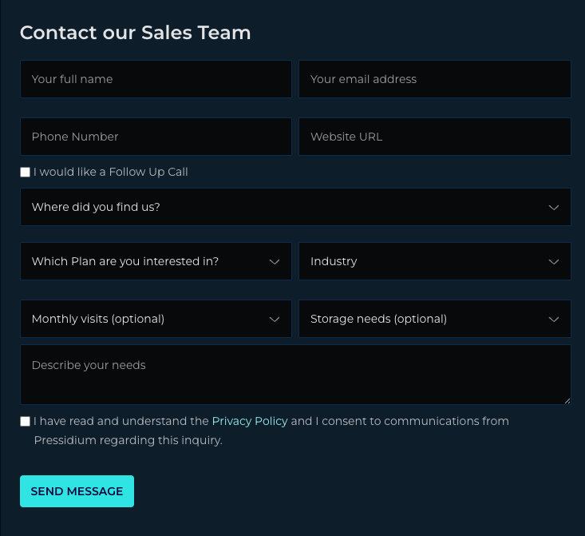

# WebMCP Contact Form Example

[](./LICENSE)

A minimal, vanilla example showing how to expose a real-world contact form as a WebMCP tool — so AI agents can fill and submit it without scraping the DOM.

WebMCP is a new browser-native API (`navigator.modelContext`) that lets a page expose typed, callable "tools" to AI agents. Instead of an agent screenshotting your page and guessing where to click, it reads a JSON Schema, calls your function, and your code runs. This demo turns Pressidium's "Contact our Sales Team" form into one such tool — using both APIs WebMCP ships with.



## Read the article

The full walkthrough is in **[`article.md`](./article.md)** — what WebMCP is, why it matters, both API surfaces (imperative JavaScript and declarative HTML), best practices, and a worked example showing a real agent (Gemini) filling and submitting the form.

## Run it locally

You'll need a WebMCP-capable browser:

- **Chrome Canary 146+** with `chrome://flags/#enable-webmcp-testing` enabled (Origin Trial available in Chrome 149+)
- The [Model Context Tool Inspector](https://developer.chrome.com/docs/ai/webmcp#imitate-agent-chat-with-the-inspector-extension) Chrome extension is useful for inspecting and manually invoking the registered tool

Then serve the repo over HTTP (WebMCP requires a secure context; `localhost` counts):

```bash
git clone https://github.com/pressidium/webmcp-example.git
cd webmcp-example
python3 -m http.server 8000
```

Open:

- `http://localhost:8000/demo/index.html` — Imperative API (JavaScript)
- `http://localhost:8000/demo/declarative.html` — Declarative API (HTML attributes only)

The `contact_sales` tool registers automatically. Without WebMCP support, the form still works — humans can fill and submit it as always. WebMCP is additive.

## What's inside

```
.
├── article.md              The tutorial walkthrough
├── demo/
│   ├── index.html          Imperative API version
│   ├── declarative.html    Declarative API version
│   ├── styles.css          Shared dark-theme styles
│   ├── form.js             Baseline submit handler (no WebMCP)
│   └── webmcp-tools.js     Imperative `contact_sales` registration
├── assets/                 Screenshots used in the article
├── LICENSE                 MIT
├── README.md
└── VERIFY.md               Console snippets to verify the demo
```

No build step, no dependencies, no server-side code. Everything is static.

## A note on the privacy policy

The form's "Privacy Policy" link points to the real [Pressidium privacy policy](https://pressidium.com/legal/privacy-policy/). If you fork this repo for a different organisation, update the link in both `demo/index.html` and `demo/declarative.html`.

## Contributing

Spotted spec drift, a broken assertion, or a Chrome version moving on? Open an issue or a PR. Style: vanilla JS, no build step, no runtime dependencies — please keep it that way.

## License

[MIT](./LICENSE) © 2026 Pressidium
